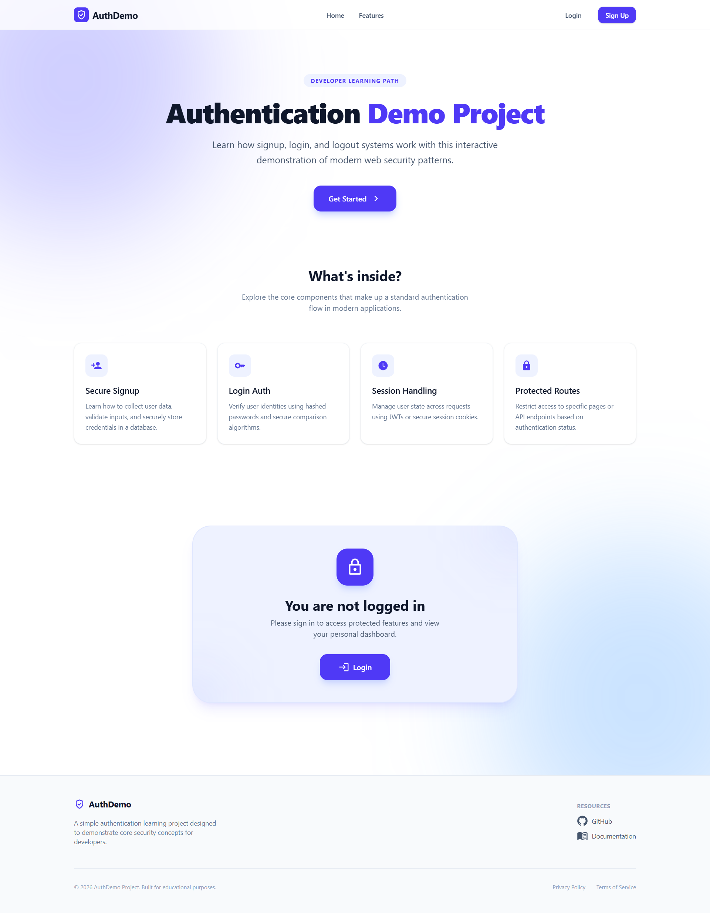
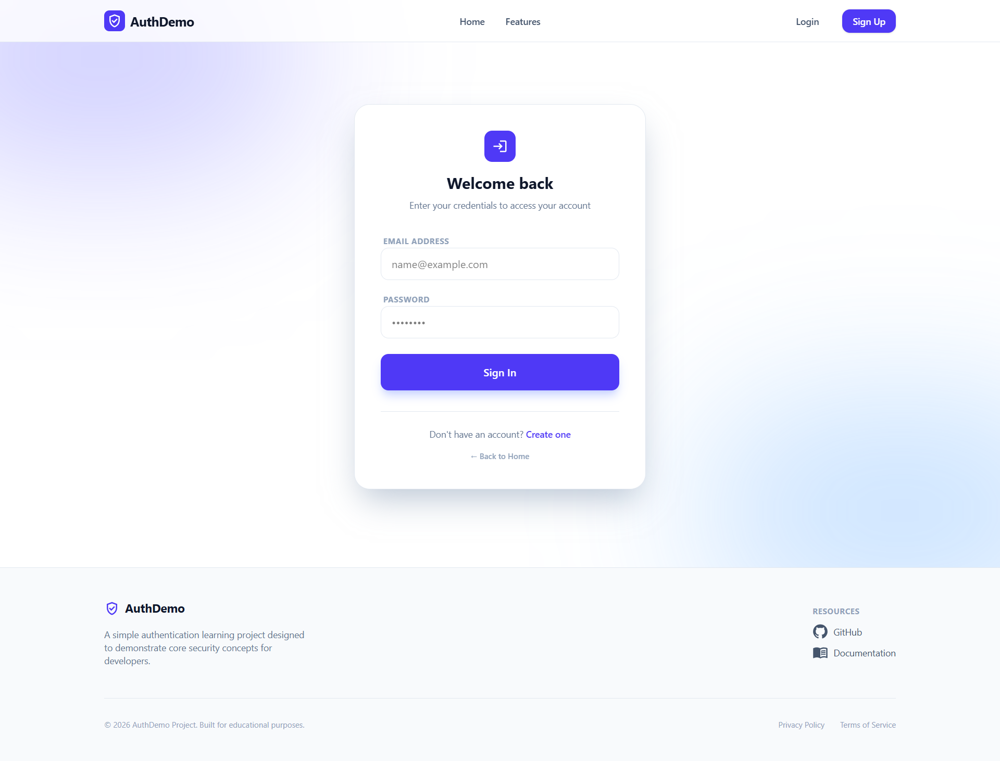
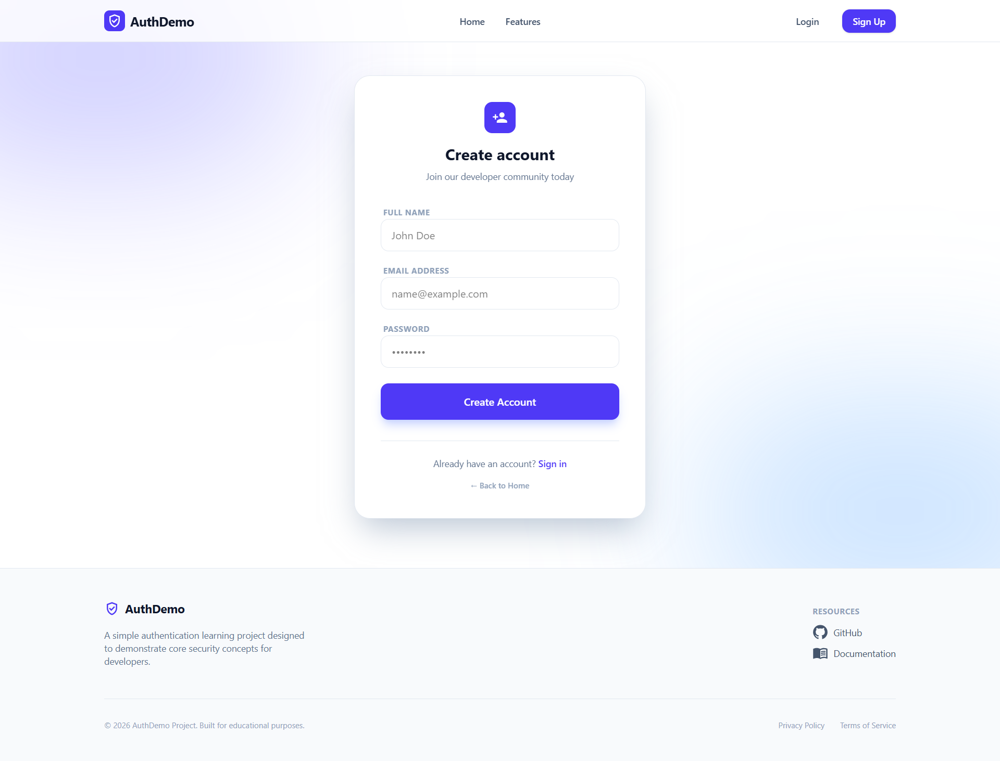
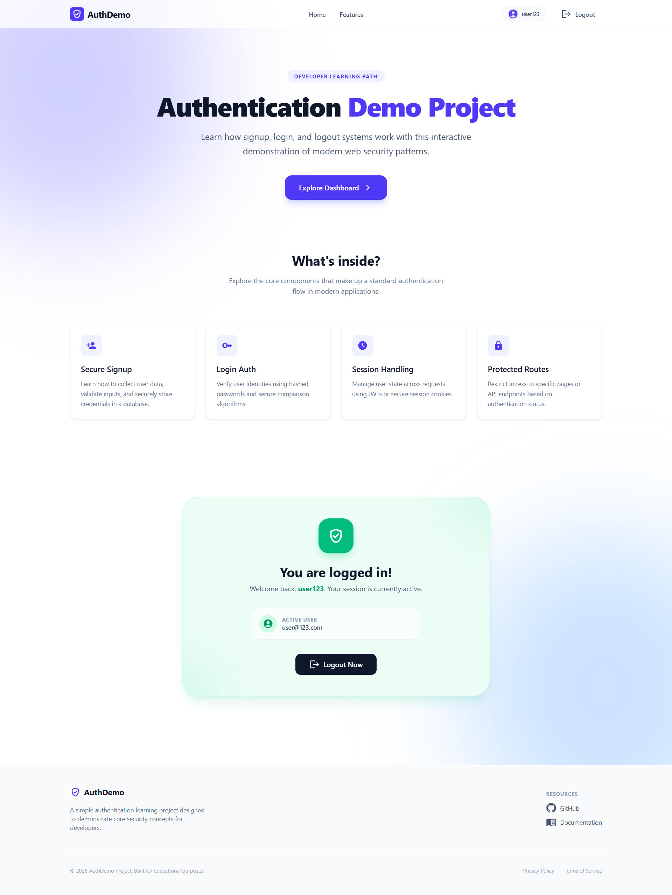

# 🚀 Auth Demo - MERN Stack Project

A full-stack authentication demo built using the **MERN stack** (MongoDB, Express, React, Node.js) with a modern frontend powered by Vite.

---

## 🌐 Live Demo

👉 **Frontend:** 
<!-- 👉 **Backend API:**  -->

---

## 📸 Screenshots

### 🏠 Home



### 🔐 Login Page



### 📝 Signup Page



### 🔓 After Login (Authenticated View)



---

## 🧰 Tech Stack

**Frontend:**

* React (Vite)
* Axios
* CSS

**Backend:**

* Node.js
* Express.js
* MongoDB

**Database:**

* MongoDB Atlas

---

## ✨ Features

* User Signup & Login
* Authentication using JWT
* Secure password handling
* Protected routes
* API integration with frontend
* Responsive UI

---

## 📁 Project Structure

```
root
│
├── client        # React frontend (Vite)
├── src           # Backend source files
├── server.js     # Backend entry point
└── README.md
```

---

## ⚙️ Environment Variables

Create a `.env` file in the root directory:

```
PORT=5000
MONGO_URI=your_mongodb_connection_string
JWT_SECRET=your_secret_key
```

---

## 🚀 Installation & Setup

### 1️⃣ Clone the repository

```
git clone https://github.com/AljuSabu/AuthDemo.git
cd AuthDemo
```

---

### 2️⃣ Install backend dependencies

```
npm install
```

---

### 3️⃣ Install frontend dependencies

```
cd client
npm install
```

---

### 4️⃣ Run the app

```
npm run dev
```
---

## 📌 Future Improvements

* Add refresh tokens
* Improve UI/UX
* Add password reset feature
* Add email verification

---

## 🤝 Contributing

Contributions are welcome! Feel free to fork this repo and submit a pull request.

---

## 📄 License

This project is open-source and available under the MIT License.

---

## 👨‍💻 Author

[AljuSabu](https://github.com/AljuSabu)

---
